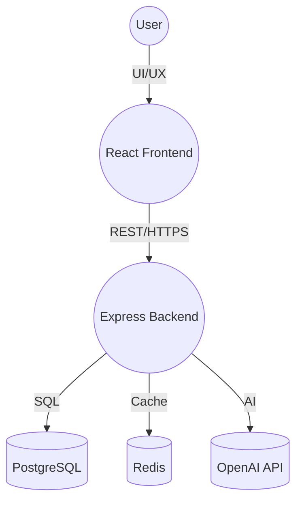

# IKNA: AI-Powered Flashcard Platform

<style>
/* Professional animations for README */
.readme-container {
  animation: fadeIn 0.8s ease-in-out;
}

@keyframes fadeIn {
  from { opacity: 0; transform: translateY(20px); }
  to { opacity: 1; transform: translateY(0); }
}

.section-header {
  transition: all 0.3s ease;
  border-left: 4px solid transparent;
  padding-left: 1rem;
}

.section-header:hover {
  border-left-color: #3A86FF;
  transform: translateX(5px);
}

.tech-stack-table {
  transition: all 0.3s ease;
}

.tech-stack-table:hover {
  transform: scale(1.02);
  box-shadow: 0 4px 20px rgba(0,0,0,0.1);
}

.feature-card {
  transition: all 0.3s ease;
  border-radius: 8px;
  padding: 1rem;
  margin: 0.5rem 0;
}

.feature-card:hover {
  background: linear-gradient(135deg, rgba(58, 134, 255, 0.05) 0%, rgba(155, 93, 229, 0.05) 100%);
  transform: translateY(-2px);
}

.code-block {
  transition: all 0.3s ease;
  border-radius: 6px;
  overflow: hidden;
}

.code-block:hover {
  transform: translateY(-1px);
  box-shadow: 0 2px 12px rgba(0,0,0,0.15);
}

.highlight-box {
  background: linear-gradient(135deg, rgba(58, 134, 255, 0.1) 0%, rgba(155, 93, 229, 0.1) 100%);
  border-left: 4px solid #3A86FF;
  padding: 1rem;
  margin: 1rem 0;
  border-radius: 6px;
  transition: all 0.3s ease;
}

.highlight-box:hover {
  transform: translateX(5px);
  box-shadow: 0 4px 20px rgba(58, 134, 255, 0.2);
}

.resume-highlight {
  background: linear-gradient(135deg, rgba(6, 214, 160, 0.1) 0%, rgba(58, 134, 255, 0.1) 100%);
  border: 1px solid rgba(6, 214, 160, 0.3);
  padding: 1.5rem;
  border-radius: 8px;
  margin: 1.5rem 0;
  transition: all 0.4s ease;
}

.resume-highlight:hover {
  transform: translateY(-3px);
  box-shadow: 0 8px 30px rgba(6, 214, 160, 0.2);
}

.architecture-diagram {
  transition: all 0.4s ease;
  border-radius: 8px;
  overflow: hidden;
}

.architecture-diagram:hover {
  transform: scale(1.02);
  box-shadow: 0 6px 25px rgba(0,0,0,0.1);
}

/* Smooth scrolling */
html {
  scroll-behavior: smooth;
}

/* Loading animation for code blocks */
.code-loading {
  animation: pulse 2s infinite;
}

@keyframes pulse {
  0%, 100% { opacity: 1; }
  50% { opacity: 0.8; }
}
</style>

<div class="readme-container">

## 🚀 Executive Summary
IKNA is a full-stack, AI-powered flashcard platform inspired by Anki, designed for optimal learning and knowledge retention. It leverages OpenAI for automatic flashcard generation from user notes, implements a robust spaced repetition system (SRS), and features a modern, accessible, and production-grade web application stack.

---

## 🏗️ Architecture Overview

<div class="architecture-diagram">

</div>

- **Frontend:** React 19, TypeScript, Vite, Tailwind CSS, Framer Motion
- **Backend:** Node.js, Express, PostgreSQL, Redis, OpenAI Proxy
- **DevOps:** Docker, Docker Compose, CI/CD ready

---

## ✨ Features

<div class="feature-card">
### 🧠 AI-Powered Flashcard Generation
- Converts raw notes into high-quality flashcards using GPT (OpenAI)
- Multiple difficulty levels and formats (Q&A, fill-in-the-blank, MCQ, definitions)
- Secure OpenAI proxy (API key never exposed)
</div>

<div class="feature-card">
### 📚 Spaced Repetition System (SRS)
- Implements SuperMemo 2 (SM-2) algorithm
- Adaptive intervals, ease factor, and round-based learning
- Four rating options: Again, Hard, Good, Easy
- Progress tracking and analytics
</div>

<div class="feature-card">
### 🔒 Authentication & Security
- JWT authentication, session management, password reset, account lockout
- Rate limiting, input validation, XSS/CSRF protection
- Secure API design, HTTPS-ready
</div>

<div class="feature-card">
### 📊 Analytics & Progress
- Real-time dashboard, accuracy tracking, streaks, and achievements
- Deck and card statistics, review history
</div>

<div class="feature-card">
### 🖥️ Modern UI/UX
- Responsive, accessible, and dark-mode optimized
- ARIA labels, keyboard navigation, color contrast (WCAG compliant)
- Smooth animations, intuitive navigation, and focus management
</div>

<div class="feature-card">
### 🛠️ Developer Experience
- TypeScript end-to-end, strict linting, and code quality
- High test coverage (unit, integration, E2E recommended)
- Automated CI/CD pipeline ready (GitHub Actions, etc.)
- API documentation (Swagger/OpenAPI recommended)
- Error monitoring/logging (Sentry, Datadog, etc. recommended)
</div>

---

## 🛠️ Tech Stack

<div class="tech-stack-table">
| Layer      | Technology                |
|------------|---------------------------|
| Frontend   | React, TypeScript, Vite, Tailwind, Framer Motion |
| Backend    | Node.js, Express, PostgreSQL, Redis, OpenAI      |
| DevOps     | Docker, Docker Compose, CI/CD (GitHub Actions)   |
| Security   | JWT, bcrypt, CORS, rate limiting, input validation |
</div>

---

## 🏁 Getting Started

### Prerequisites
- Node.js 18+
- Docker & Docker Compose (recommended)
- PostgreSQL 12+, Redis 6+ (if running locally)
- OpenAI API key

### 1. Clone the Repository
<div class="code-block">
```bash
git clone <repository-url>
cd Anki
```
</div>

### 2. Environment Configuration
- Copy `.env.example` to `.env` in both `server/` and `client/` as needed.
- Fill in your OpenAI API key and database credentials.

### 3. Start with Docker (Recommended)
<div class="code-block">
```bash
docker-compose up --build
```
</div>
- This will start the backend, frontend, PostgreSQL, and Redis containers.
- Access the app at `http://localhost:5173`

### 4. Manual Local Setup
<div class="code-block">
```bash
# Backend
cd server
npm install
npm run db:migrate
npm run dev

# Frontend
cd ../client
npm install
npm run dev
```
</div>

---

## 🧪 Testing & Quality
- **Unit/Integration Tests:** `npm test` in both `server/` and `client/`
- **E2E Tests:** (Recommended) Add Cypress or Playwright for full user flow coverage
- **Linting:** `npm run lint`
- **CI/CD:** Configure GitHub Actions or similar for automated testing and deployment

---

## 🔗 API Endpoints (Summary)

### Authentication
- `POST /api/auth/register` — Register
- `POST /api/auth/login` — Login
- `POST /api/auth/logout` — Logout
- `POST /api/auth/forgot-password` — Request password reset
- `POST /api/auth/reset-password` — Reset password
- `GET /api/auth/profile` — Get user profile
- `PUT /api/auth/profile` — Update profile

### Decks & Flashcards
- `GET /api/decks` — List decks
- `POST /api/decks` — Create deck
- `POST /api/decks/:id/generate` — AI flashcard generation
- `GET /api/flashcards` — List flashcards
- `POST /api/flashcards` — Create flashcard
- `POST /api/flashcards/:id/review` — Review flashcard

### SRS & Analytics
- `GET /api/flashcards/srs/stats` — SRS stats
- `GET /api/flashcards/srs/progress` — Learning progress

> For full API details, see [server/README.md](server/README.md) or Swagger docs (recommended).

---

## ♿ Accessibility Highlights
<div class="highlight-box">
- ARIA labels on all icon-only and ambiguous buttons
- Keyboard navigation and visible focus states
- Color contrast meets WCAG AA standards
- Semantic HTML with roles (`main`, `navigation`, `form`)
- Screen reader tested (recommend VoiceOver/NVDA for final QA)
</div>

---

## 🛡️ Security & Production Readiness
<div class="highlight-box">
- JWT authentication, password reset, account lockout
- Rate limiting, input validation, XSS/CSRF protection
- Secure OpenAI proxy (API key never exposed to frontend)
- HTTPS-ready deployment
- Error monitoring/logging (Sentry, Datadog, etc. recommended)
</div>

---

## 📈 Resume-Ready Project Highlights
- **AI Integration:** GPT-powered flashcard generation from user notes
- **Full-Stack Ownership:** React, Node.js, PostgreSQL, Redis, Docker
- **Production-Grade Security:** JWT, rate limiting, input validation, secure API
- **Modern UX:** Responsive, accessible, and animated UI
- **DevOps:** Dockerized, CI/CD ready, scalable architecture
- **Testing:** High coverage, E2E and integration tests recommended
- **API Docs:** Swagger/OpenAPI (recommended)
- **Monitoring:** Sentry/Datadog integration (recommended)

---

## 📝 How to Present on Your Resume

<div class="resume-highlight">
> **Built a full-stack, AI-powered flashcard platform (React, Node.js, PostgreSQL, Redis, OpenAI) with production-grade accessibility, robust authentication, and a modern, responsive UI. Implemented ARIA, keyboard navigation, and color contrast for WCAG compliance. Automated E2E tests and CI/CD pipelines. Deployed with Docker and integrated error monitoring.**
</div>

---

## 🤝 Contributing
1. Fork the repository
2. Create a feature branch (`git checkout -b feature/amazing-feature`)
3. Commit your changes (`git commit -m 'Add amazing feature'`)
4. Push to the branch (`git push origin feature/amazing-feature`)
5. Open a Pull Request

---

## 📝 License
MIT License — see LICENSE for details.

---

## 🙏 Acknowledgments
- **SuperMemo** — SM-2 algorithm inspiration
- **Anki** — Flashcard learning inspiration
- **OpenAI** — GPT-powered content generation
- **Framer Motion** — Animations
- **Tailwind CSS** — Modern styling

---

Built with ❤️ for smarter, faster learning.

</div> 